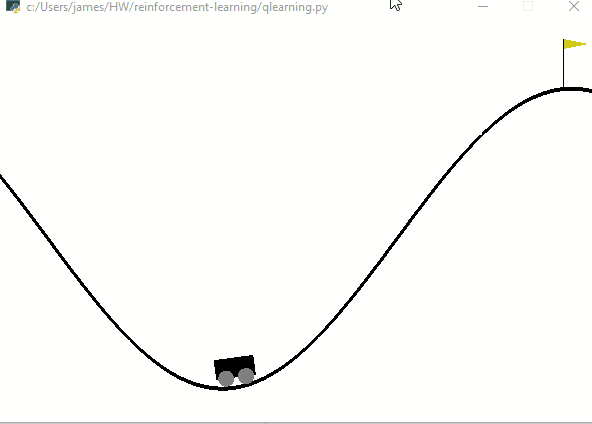
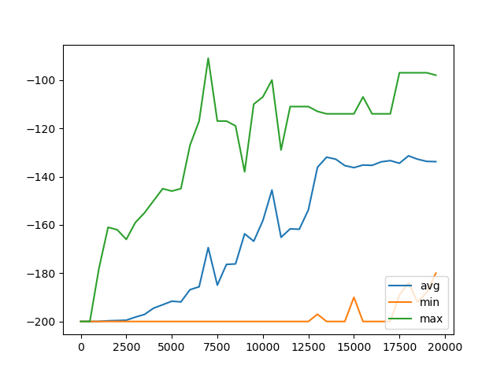
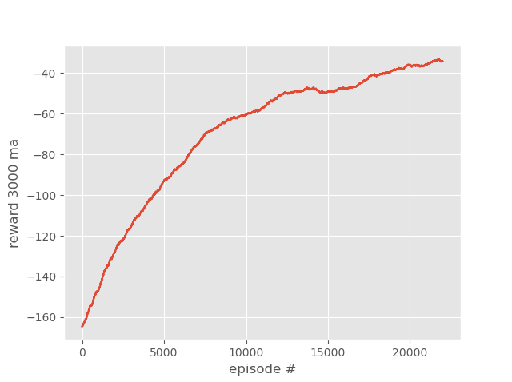

# reinforcement-learning

## Background
The purpose of this project is to learn how to apply reinforcement learning on Python. Reinforcement learning is where the AI figuring out what actions are beneficial based on the rewards it is getting after each episode.  First part is to use the gym environment in Python and the goal is to use Q learning to make the car go up the cliff. Second part is to make our own environment where the the goal of the game is for the player(blue) to avoid the enemy(red) and eat food(green). This project was based off of tutorials from [pythonprogramming.net](https://pythonprogramming.net/q-learning-reinforcement-learning-python-tutorial)

## Preview
### First project (car)

### Second project (game)
#### Before it was trained

#### After it was trained

## results
The charts below show the rewards(how well it did) over the period of episodes. As the AI goes through more episodes, the results were better.

